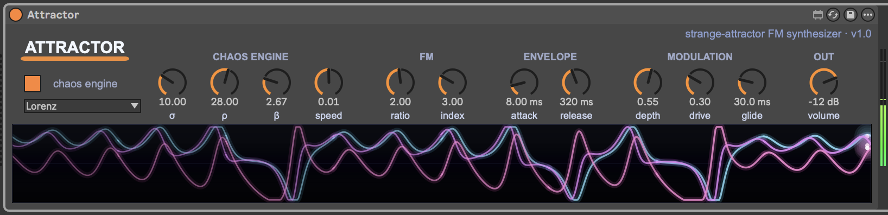

# ATTRACTOR — Strange-Attractor FM Synthesizer for Max for Live

A chaos-driven FM synthesizer device for Ableton Live 12 (Max for Live, instrument). Four classic strange attractors (Lorenz, Rössler, Aizawa, Thomas) integrate at 200 Hz inside a JS engine and modulate a 2-operator FM voice in real time — chaos as a never-repeating, bounded modulation source. The attractor's trajectory is rendered live as a triple-trace scrolling oscilloscope across the bottom of the device.

  



## Features

- **Four strange attractors** — Lorenz (classic butterfly), Rössler (single-loop), Aizawa (spiraling sphere), Thomas (gentle cyclic drift). Each gives a distinct chaos signature.
- **Chaos modulates ratio, FM index, and amplitude** — the attractor's three axes drive different parameters of the FM voice in parallel; depth scales how strongly chaos overrides the static dial values.
- **2-operator FM synthesis** — phasor~/cos~ pair with phase-mod, carrier ratio + index controls, drive (tanh saturation), and an ADSR envelope.
- **Velocity-aware** — per-note level scales with MIDI velocity; envelope normalised so high velocity doesn't overshoot.
- **Glide / portamento** for legato lines.
- **Full bottom-strip visualizer** — triple-trace oscilloscope (one trace per chaos axis), per-mode color palette, motion blur, glow, auto-scaling and DC-blocking so every attractor shows up centered regardless of its natural offset.
- **Note-gated animation** — the visualizer fades when no notes are held; chaos engine can also be toggled OFF entirely (greying out the chaos-only controls so the inert state is obvious).
- **Self-contained `.amxd`** — `attractor_viz.js` is embedded inside the frozen Live device. Drag one file and it works.
- All parameters automatable, mappable, and annotated for Live's hover-info panel.

## Install

1. Drag `Attractor.amxd` from the repo into a MIDI track in Ableton Live 12 (or copy to your User Library).
2. Play any note — chaos engine is ON by default; the FM voice and visualizer fire up immediately.
3. (Optional) Map any dial to a Live macro / MIDI controller via right-click → Map.

## Parameters

| Name    | Type   | Range                | Description                                                     |
|---------|--------|----------------------|-----------------------------------------------------------------|
| Chaos   | toggle | off / on             | Master switch for the chaos engine                              |
| Type    | menu   | Lorenz / Rössler / Aizawa / Thomas | Strange-attractor algorithm                       |
| σ       | dial   | 1–30                 | Lorenz σ (Prandtl number) — wilder swirl when higher            |
| ρ       | dial   | 1–50                 | Lorenz ρ (Rayleigh number) — below ~24 the system settles       |
| β       | dial   | 0.1–10               | Lorenz β — vertical damping; classic value 8/3 ≈ 2.667          |
| Speed   | dial   | 0.0001–0.02 (exp)    | Integration step size                                           |
| Ratio   | dial   | 0.25–8 (exp)         | FM modulator-to-carrier frequency ratio                         |
| Index   | dial   | 0–10                 | FM modulation index (0 = pure sine, higher = brighter)          |
| Attack  | dial   | 1–2000 ms (exp)      | Note attack time                                                |
| Release | dial   | 5–4000 ms (exp)      | Note release time                                               |
| Depth   | dial   | 0–1                  | Strength of chaos modulation across ratio / index / amp         |
| Drive   | dial   | 0–1                  | Soft saturation (tanh waveshaper) on the carrier                |
| Glide   | dial   | 0–500 ms (exp)       | Portamento between notes                                        |
| Volume  | dial   | -60 to +6 dB         | Output level (per-note level also scales with MIDI velocity)    |

Hover over any control in Live to see the description in the bottom info panel.

## Architecture

DSP voice: `[midiparse]` → `[stripnote]/[unpack]` (parallel paths so velocity reaches `[adsr~]` for both note-on and note-off; `stripnote` only fires on note-on so `mtof` doesn't glitch under legato) → `[mtof]` → `[pack freq glide_ms]` → `[line~]`. Velocity is divided by 127 before `[adsr~]` so the envelope tops out at ≤1.0 (avoids volume overshoot). Carrier `[phasor~]` → `+~` PM offset → `[cos~]` → `[*~ drive_scale]` → `[tanh~]` → `*~ envelope` → `*~ (1 + z·depth·0.3)` (chaos amp mod) → `*~ 0.5` (trim) → `*~ dbtoa(volume)` → `[tanh~]` (final brick-wall safety limiter) → `[plugout~ 1 2]`. The volume dial is implemented manually via `dbtoa → pak 0.0 20. → line~ → *~` rather than `live.gain~` so the dB curve and parameter range can be tuned independently of Live's stock gain widget.

Chaos engine: `attractor_viz.js` runs both the integrator (Lorenz/Rössler/Aizawa/Thomas, ~600 substeps/s) and the visualizer in a single `[jsui]`. The integrator writes back to outlets 0/1/2 (x/y/z) which feed `line~`-smoothed signals into the FM voice. The metro that drives the JS is gated by `[snapshot~]` of the envelope AND the chaos toggle — chaos integrates only while a note is held, which is what stops the visualizer from animating with no input. A separate always-on slow `metro 50 → "fade"` keeps the fade-out animation running after notes release.

`build_attractor.py` is the patch generator — it composes the `.maxpat` JSON programmatically. `pack_amxd.py` then packs the patch + `attractor_viz.js` into a self-contained frozen `.amxd` binary container (`ampf` → `meta` → `ptch` → `mx@c` chunks with an embedded directory of files). No external template file is needed.

## Compatibility

- **Ableton Live 12** required — uses Live 12 device-height conventions (169 px) and modern parameter init layout.
- **Max for Live 8.5+**.
- Built and tested on macOS. Windows untested but should work — only the build script touches macOS-specific code paths.

## Build / Modify

`build_attractor.py` and `pack_amxd.py` (Python 3.11+) generate the `.maxpat` and the frozen `.amxd` respectively. Edit the source and re-run:

```bash
python3.11 build_attractor.py     # regenerates Attractor.maxpat
python3.11 pack_amxd.py           # packs into Attractor.amxd
```

The `.amxd` binary container is the frozen format Max produces from "Freeze Device":

```
'ampf' [LE u32 = 4]   "iiii"                  ← device-type tag (instrument)
'meta' [LE u32 = 4]   uint32_LE(7)            ← format version (frozen)
'ptch' [LE u32 = N]
  'mx@c' [BE u32 = 16]                        ← data offset (constant)
  [BE u64 = footer_offset]                    ← absolute from 'mx@c' byte 0
  [patcher JSON]                              ← Attractor.maxpat
  [attractor_viz.js bytes]
  'dlst' [BE u32 = N]                         ← embedded-files directory
    'dire' entries (type, fnam, sz32, of32, vers, flag, mdat)
```

The script generates this structure directly — no external `.amxd` template needed. The frozen format matches what Max's own Freeze Device produces, so the output drops straight into the User Library and works without any loose `.js` files alongside.

## Author

[Adrian Kwiatkowski](https://adriankwiatkowski.eu) — electronic music producer.

Listen: [Spotify](https://open.spotify.com/artist/0bnPfchFpM2qLv1xrCK727) · [Bandcamp](https://adriankwiatkowski.bandcamp.com) · [SoundCloud](https://soundcloud.com/adriank1410) · [Apple Music](https://music.apple.com/artist/adrian-kwiatkowski/1039714796) · [YouTube](https://www.youtube.com/c/AdrianKwiatkowski)

## License

MIT — see [LICENSE](LICENSE). You can edit, modify, redistribute, and use ATTRACTOR in commercial productions; please retain the copyright notice in derivative works.
